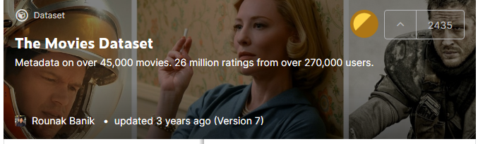
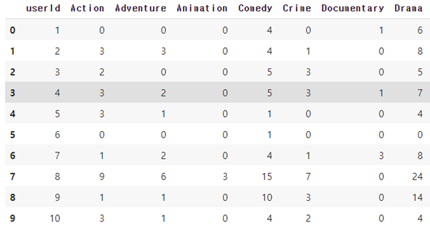
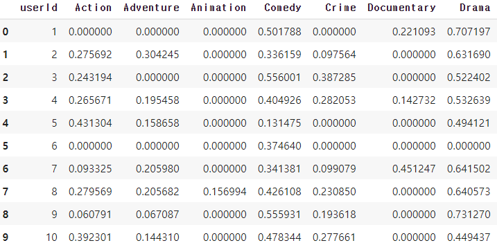
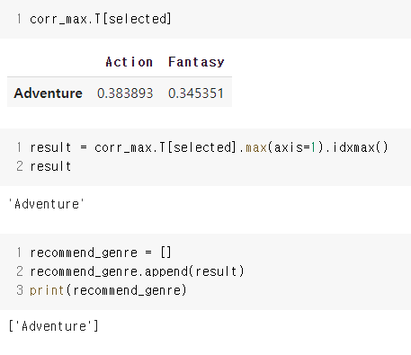
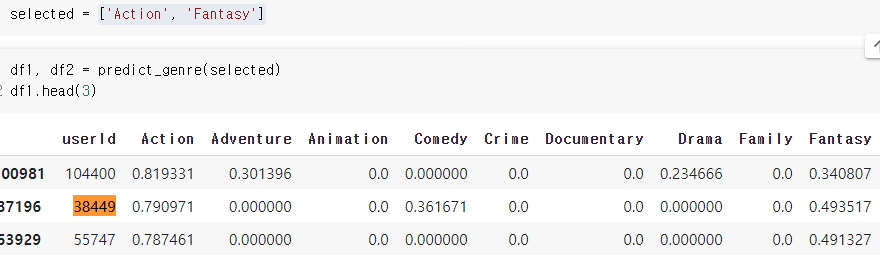
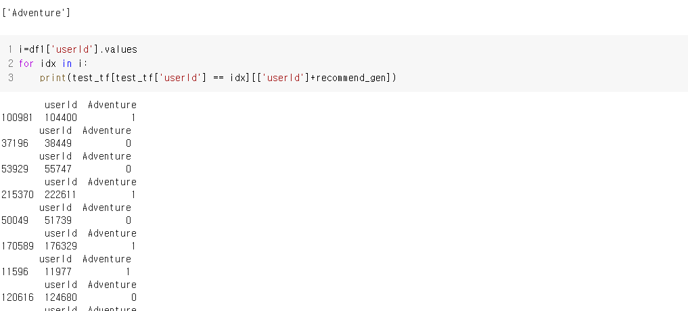
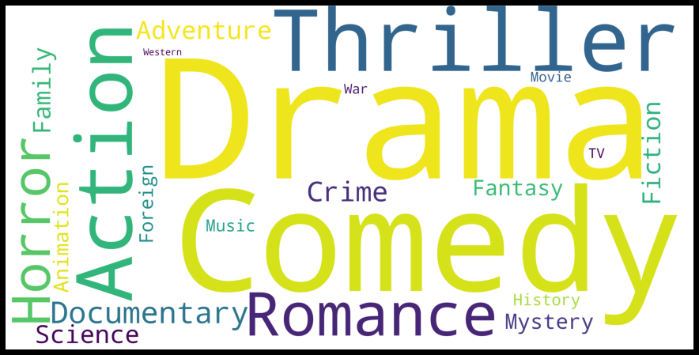

# 사용자 장르 선호도를 이용한 장르 추천 모델 설계

    - 건국대학교 컴퓨터공학부
    - 20151128 남기용
 

# 개요

영화 장르는 주제, 줄거리, 분위기 등을 포함하는 특성이고, 장르가 같은 영화들은 비슷한 줄거리, 주제, 분위그 등을 가진다고 볼 수 있다. 또한 영화 제작자나 관련 전문가에 의해 영화 장르가 분류된다. 사용자가 새로운 영화를 선택할 때, 장르로부터 유추된 내용을 바탕으로 의사결정하기 때문에, 영화 장르는 영화의 선호도를 대표할 수 있는 단서가 될 수 있다고 판단했다. 우리는 이러한 점에 착안하여 기존 사용자들의 장르 선호도를 바탕으로 새로운 유저가 선호할 만한 장르를 추천해주는 것을 목표로 한다.

    키워드 : 추천 알고리즘, 장르 기반 추천, 장르 상관 관계

# 실험데이터 
실험 데이터로는 캐글의 영화 데이터셋을 이용했다.

https://www.kaggle.com/rounakbanik/the-movies-dataset

# 데이터 전처리

우리가 만들고자 하는 모델에서 필요없는 영화들을 제외한다.

우선 영화 상영일이 너무 오랜된 경우에는 우리가 하는 프로젝트의 목표 사용자 연령대에 맞지 않다고 생각되어 제외한다.

또 영화 데이터셋에 평가가 없는 경우, 장르가 비어있는 경우, 줄거리가 비어있는 경우 등은 모델 학습에 있어 좋지않기 때문에 제외했다.

# 장르 추천 모델

과거 사용자들의 영화 평가 정보를 바탕으로 과거 사용자들의 선호 영화 장르와 영화 장르 사이의 유사도를 도출하여 프로파일을 생성하고, 새로운 유저에게 적합한 장르를 추천해주는 것을 목표로 한다.

## tf 값 계산
과거 사용자들의 평가 정보에서 영화에 대해 평가를 했다면 그 영화를 시청했다고 생각을 하고 그 영화의 장르를 선호한다고 판단을 했다.

이를 바탕으로 사용자X장르 매트릭스를 생성했고 사용자들이 어떤 장르를 많이 봤는지 사용자 별 선호 장르에 대해 파악할 수 있었다.

 - 표1) tf 매트릭스의 일부
## tf-idf 계산

하지만 tf 값만으로는 사용자 사이의 장르 선호도를 정확하게 비교하기에는 어려움이 있었고

 이를 tf-idf 값으로 사용자X장르 매트릭스를 만들어 비교를 했다

- 표2) tf-idf 매트릭스의 일부

# 장르 추천

tf-idf를 선호한다고 선택한 장르를 기준으로 내림차순 정렬을 하였을 때 상위 100개를 가져온다.

그리고 상위 100개 중 tf-idf 값이 0이 아닌 장르 중 가장 많이 count 된 값을 새로운 장르로 추천한다.

하지만 tf-idf 값을 기준으로 장르를 추천했을 때 몇 가지 문제가 예상되어 수정이 필요하다.

# Risk Analysis

- 데이터량이 많아 tf-idf 매트릭스를 구하는 것과 장르 간의 상관 관계를 구하는데 시간이 오래걸렸다.
    
    - 매번 추천할 때마다 tf-idf 매트릭스를 구하는 것이 아니라 미리 tf-idf 매트릭스를 csv 파일에 저장한 후 추천이 필요할 때마다 파일을 불러와서 이용하는 식으로 해결했다.
    - 사전에 정의된 파일을 불러와 추천하기 때문에 장르 추천에서 피드백 방법의 부재

- A장르를 선호하는 사용자가 B장르를 선호하는 정도와 B장르를 선호하는 사용자가 A장르를 선호하는 정도의 차이를 반영하지 못한다.
    -  관련 논문을 추가로 찾아보고 논문을 바탕으로 선호도 매트릭스를 수정할 예정이다.

- tf-idf 의 불확실함
    - tf-idf 값을 기준으로 장르를 추천해주는데 여기서 몇가지 문제가 발생했다.
    - 실제 tf-idf 값이 높아 추천했는데 실제로 사용자가 해당 장르에 대해 평가한 결과가 적은 경우가 있다. 이런 경우 추천 모델의 신뢰도가 떨어진다.
    - 위와 마찬가지로 관련 논문을 추가로 찾아보고 다른 요소를 추가하여 정확한 추천을 할 수 있도록 할 예정이다.

- 장르 추천 방식의 불합리함
    - 상위 100개 중 값이 0이 아닌 장르 중 가장 많이 count 된 값을 선택하는데 이 경우에 상위 100명의 사용자가 모두 한 번이지만 특정 장르를 시청한 경우 다른 빈도 높은 장르에 비해 추천될 확률이 높다.

    액션, 판타지를 선호한다고 했을 때, tf-idf값 중 높은 것을 선택하고 count가 가장 많은 장르를 추천하고 추천된 장르와 기존의 선택한 장르와 상관관계를 고려하여 최종적으로 장르를 추천하게 된다. 이 때 추천된 장르는 어드벤처인데 tf 매트릭스 상에서 상위 100명의 어드벤처 장르의 시청수를 보면 1 또는 2 정도로 매우 낮은 수치를 보이고 있다.

    또한 사용자가 시청한 전체 영화에 대한 장르의 빈도를 시각화한 것인데 어드벤처는 여기서 높은 빈도를 보이지 못한다.

    여러가지 요인을 분석했을 때 액션, 판타지를 선호한다고 입력한 결과 어드벤처를 추천해준다는 것은 신뢰성이 떨어진다는 생각이 들었고 여러 방법을 통해 해결해 보려고 한다.

# 2nd Iteration

최종 발표 전까지 아래의 항목을 최대한 수정하려고 한다.

- tf-idf 매트릭스만으로 정확한 장르를 추천할 수 없기 때문에 유저 선호도 매트릭스에 대한 추가적인 검토와 더 나은 매트릭스 모델을 생성
- 장르 간의 상관관계를 더 나은 방법으로 표현하고 A장르 선호 사용자의 B장르 선호도와 B장르 선호 사용자의 A장르 선호도의 차이를 줄이는 방법을 고함
- 여러가지 방법으로 구현된 모델을 적절히 사용해 최적화된 장르를 추천할 수 있도록 함

# 참고 문헌

- 황태규, 김성권 (2020). 장르 상관관계를 사용한 영화추천 알고리즘. 정보과학회 컴퓨팅의 실제 논문지,
26(9), 429-434.
- 김경록, 변재희, 문남미 (2011). 장르 유사도와 선호장르를 이용한 협업필터링 설계. 韓國컴퓨터情報學會 論文誌 第16卷 第4號
- 김동욱, 김성근, 강주영 (2017). 무비렌즈 데이터를 이용한 하이브리드 추천 시스템에 대한 실증연구. 한국빅데이터학회지 제2권 제1호, 2017, pp. 41-48
- Chen Ma, 김강철 (2021). 잠재요인 모델 기반 영화 추천 시스템. JKIECS, vol. 16, no. 01, 125-134, 2021